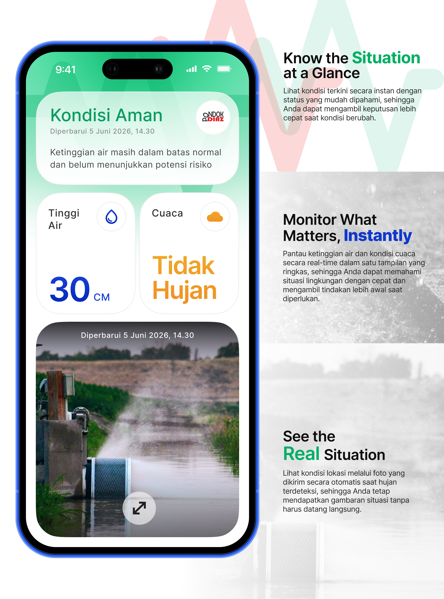
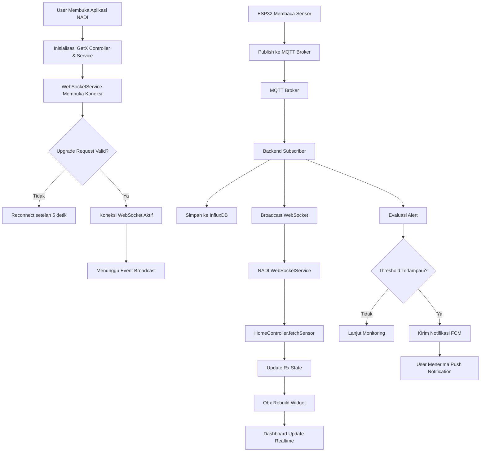

<div align="center">


# NADI

### **N**etwork **A**quatic **D**etection & **I**nsight

Aplikasi mobile pemantauan drainase berbasis IoT secara real-time.

[](https://flutter.dev)
[](https://pub.dev/packages/get)
[](https://firebase.google.com)
[](https://datatracker.ietf.org/doc/html/rfc6455)

</div>

---

## Daftar Isi

- [Tentang NADI](#tentang-nadi)
- [Fitur Utama](#fitur-utama)
- [Tampilan Aplikasi (Mockup)](#tampilan-aplikasi-mockup)
- [Arsitektur Sistem](#arsitektur-sistem)
- [Alur Komunikasi WebSocket](#alur-komunikasi-websocket)
- [Alur Notifikasi (Alert Flow)](#alur-notifikasi-alert-flow)
- [Teknologi yang Digunakan](#teknologi-yang-digunakan)
- [Struktur Proyek](#struktur-proyek)
- [Model Data](#model-data)
- [Endpoint Backend](#endpoint-backend)
- [Konfigurasi](#konfigurasi)
- [Cara Menjalankan](#cara-menjalankan)
- [Build Aplikasi](#build-aplikasi)
- [Lisensi](#lisensi)

---

## Tentang NADI

**NADI (Network Aquatic Detection & Insight)** adalah aplikasi mobile yang dibangun dengan **Flutter** untuk memantau kondisi drainase/saluran air secara **real-time**. Aplikasi ini menampilkan data sensor IoT — seperti ketinggian air, status keamanan, dan deteksi hujan — yang dikirim langsung dari perangkat **ESP32** di lapangan, diproses oleh backend, dan diteruskan ke aplikasi tanpa perlu *polling* HTTP berkala.

Tujuan utama NADI adalah memberikan **deteksi dini** terhadap potensi genangan atau banjir, lengkap dengan **push notification** ketika kondisi melewati ambang batas yang ditentukan — bahkan ketika aplikasi berada di latar belakang.

> Aplikasi ini memantau satu unit perangkat drainase IoT yang teridentifikasi melalui `deviceId` (lihat [Konfigurasi](#konfigurasi)).

---

## Fitur Utama

| Fitur | Deskripsi |
| --- | --- |
| 📡 **Pemantauan Real-time** | Data sensor diterima secara langsung melalui koneksi WebSocket persisten. |
| 🌊 **Status Ketinggian Air** | Menampilkan tinggi air dalam satuan sentimeter (cm) dengan animasi transisi. |
| 🟢🔴 **Indikator Kondisi** | Visual adaptif (hijau = aman, merah = perlu perhatian) berdasarkan status sensor. |
| 🌧️ **Deteksi Hujan** | Menampilkan informasi cuaca/deteksi hujan dari sensor. |
| 📷 **Snapshot Visual** | Menampilkan gambar kondisi lapangan terbaru beserta waktu pembaruan. |
| 🔔 **Push Notification (FCM)** | Notifikasi peringatan dini melalui Firebase Cloud Messaging, aktif walau aplikasi di-background. |
| 🔄 **Auto-Reconnect** | Koneksi WebSocket otomatis tersambung kembali bila terputus. |
| ⚡ **Reactive UI** | Antarmuka diperbarui otomatis menggunakan `Obx` dari GetX tanpa refresh manual. |

---

## Tampilan Aplikasi (Mockup)

Berikut adalah pratinjau antarmuka aplikasi NADI:

<div align="center">



</div>

Antarmuka utama terdiri dari beberapa kartu (*card*) reaktif:

- **Status Card** — menampilkan ringkasan kondisi ("Kondisi Aman" / "Perlu Perhatian") beserta waktu pembaruan terakhir.
- **Height Card** — menampilkan ketinggian air (cm) dengan gradien warna yang berubah sesuai status.
- **Weather Card** — menampilkan status deteksi hujan.
- **Image Card** — menampilkan snapshot visual kondisi drainase di lapangan.

Latar belakang halaman menggunakan *radial gradient* dan ilustrasi yang ikut berubah warna (hijau/merah) mengikuti status sensor secara dinamis.

---

## Arsitektur Sistem

Alur data NADI mengikuti rantai komunikasi dari perangkat IoT hingga ke layar pengguna:

```text
┌──────────┐
│  ESP32   │  Membaca sensor (jarak air, hujan)
└────┬─────┘
     │ MQTT Publish
     ▼
┌──────────┐
│  MQTT    │  Message Broker
│  Broker  │
└────┬─────┘
     │ MQTT Subscribe
     ▼
┌──────────┐
│ Backend  │  Validasi, simpan, evaluasi alert
│ Golang   │
└────┬─────┘
     ├──────────────► InfluxDB        (penyimpanan time-series)
     ├──────────────► Firebase FCM    (push notification)
     │ WebSocket Broadcast
     ▼
┌──────────┐
│  NADI    │  Flutter Mobile App
│  Mobile  │
└────┬─────┘
     │
     ▼
┌──────────┐
│  GetX    │  State Management (Rx)
│  State   │
└────┬─────┘
     │
     ▼
┌──────────┐
│ Reactive │  Obx Widget (UI otomatis)
│   UI     │
└──────────┘
```

**Komponen sistem:**

- **ESP32** — perangkat pengirim data sensor.
- **MQTT Broker** — perantara pesan (*message broker*).
- **Backend Golang** — *subscriber* MQTT, pemroses data, dan penyedia WebSocket/REST API.
- **InfluxDB** — basis data *time-series* untuk menyimpan riwayat sensor.
- **Firebase Cloud Messaging (FCM)** — media *push notification*.
- **WebSocket** — kanal komunikasi *real-time* dua arah.
- **Flutter + GetX** — aplikasi klien (NADI) sebagai penerima dan penampil data.

---

## Alur Komunikasi WebSocket

WebSocket digunakan sebagai **pemicu (trigger)** real-time. Saat backend melakukan *broadcast*, aplikasi langsung mengambil data sensor terbaru melalui REST API.

```text
ESP32
  │  MQTT Publish
  ▼
MQTT Broker
  │  Forward
  ▼
Backend Subscriber
  ├── Simpan ke InfluxDB
  ├── Evaluasi Alert ──► (jika perlu) Kirim FCM
  └── Broadcast WebSocket
            │
            ▼
NADI WebSocket Service   (event diterima)
            │
            ▼
HomeController.fetchSensor()  (ambil data terbaru via REST)
            │
            ▼
Rx Variables  (waterLevelCm, sensorStatus, rainDetected, ...)
            │
            ▼
Obx Widget  →  Dashboard Update Realtime
```

**Ringkasan langkah:**

1. Aplikasi NADI dibuka → `HomeBinding` menginisialisasi `WebSocketService`.
2. `WebSocketService` membuka koneksi persisten ke `wss://.../ws`.
3. Backend melakukan *protocol upgrade* HTTP → WebSocket (`101 Switching Protocols`).
4. ESP32 mengirim data sensor melalui MQTT ke broker.
5. Backend memproses payload: menyimpan ke InfluxDB, mengevaluasi alert, dan melakukan *broadcast* WebSocket.
6. `WebSocketService` di NADI menerima event dari *stream*.
7. `HomeController` menangkap event lalu memanggil `fetchSensor()` untuk mengambil data terbaru.
8. Variabel reaktif (`Rx`) diperbarui dengan nilai sensor terbaru.
9. Widget `Obx` melakukan *rebuild* otomatis → dashboard menampilkan data terbaru tanpa *polling*.

### Activity Diagram



---

## Alur Notifikasi (Alert Flow)

Notifikasi dikelola oleh `FcmService` dan akan tetap diterima meski aplikasi berada di **background**.

```text
Backend  (threshold terlampaui)
   │
   ▼
Firebase Cloud Messaging (FCM)
   │
   ▼
NADI Mobile App  →  Local Notification (heads-up: suara + getar)
```

**Mekanisme registrasi token:**

1. Saat aplikasi pertama dijalankan, NADI meminta izin notifikasi.
2. Membuat `app_instance_id` (UUID v4) unik per instalasi dan menyimpannya secara persisten.
3. Mendaftarkan `fcm_token` ke backend melalui `POST /api/register-token`.
4. Token hanya diregistrasi ulang bila berubah (`onTokenRefresh`), agar tidak terjadi registrasi berulang.
5. Pesan *foreground* ditampilkan via `flutter_local_notifications` pada channel `high_importance_channel`.

---

## Teknologi yang Digunakan

| Kategori | Teknologi |
| --- | --- |
| **Framework** | Flutter (SDK `^3.11.1`) |
| **State Management** | [GetX](https://pub.dev/packages/get) (`get: ^4.7.3`) |
| **Realtime** | [web_socket_channel](https://pub.dev/packages/web_socket_channel) (`^3.0.1`) |
| **HTTP/REST** | GetConnect (GetX) & [http](https://pub.dev/packages/http) |
| **Push Notification** | [firebase_core](https://pub.dev/packages/firebase_core), [firebase_messaging](https://pub.dev/packages/firebase_messaging) |
| **Local Notification** | [flutter_local_notifications](https://pub.dev/packages/flutter_local_notifications) |
| **Penyimpanan Lokal** | [shared_preferences](https://pub.dev/packages/shared_preferences) |
| **Typography** | [google_fonts](https://pub.dev/packages/google_fonts) (Inter) |
| **Icon & Splash** | [flutter_launcher_icons](https://pub.dev/packages/flutter_launcher_icons), [flutter_native_splash](https://pub.dev/packages/flutter_native_splash) |

> Pola arsitektur mengikuti struktur **GetX CLI** (modules, bindings, controllers, views, providers, services).

---

## Struktur Proyek

```text
lib/
├── main.dart                          # Entry point: init Firebase, FCM, GetMaterialApp
├── firebase_options.dart              # Konfigurasi Firebase (auto-generated)
│
├── app/
│   ├── core/
│   │   └── app_constants.dart         # Base URL API & deviceId
│   │
│   ├── routes/
│   │   ├── app_pages.dart             # Definisi halaman & routing
│   │   └── app_routes.dart            # Konstanta path route
│   │
│   ├── data/
│   │   ├── models/
│   │   │   ├── sensor_model.dart      # Model data sensor
│   │   │   └── image_model.dart       # Model snapshot gambar
│   │   └── providers/
│   │       ├── sensor_provider.dart   # GET /sensor/latest/{deviceId}
│   │       ├── image_provider.dart    # GET/POST/DELETE /image
│   │       └── fcm_token_provider.dart# POST /register-token
│   │
│   ├── services/
│   │   ├── websocket_service.dart     # Koneksi WebSocket + auto-reconnect
│   │   └── fcm_service.dart           # Registrasi token & handling notifikasi
│   │
│   └── modules/
│       └── home/
│           ├── bindings/
│           │   └── home_binding.dart  # Dependency injection
│           ├── controllers/
│           │   └── home_controller.dart # Logika & state reaktif
│           └── views/
│               └── home_view.dart     # UI halaman utama
│
├── widgets/
│   ├── status_card.dart               # Kartu status kondisi
│   ├── height_card.dart               # Kartu ketinggian air
│   ├── weather_card.dart              # Kartu deteksi hujan
│   └── image_card.dart                # Kartu snapshot visual
│
└── components/
    └── status_aware_halo.dart         # Komponen efek halo adaptif status

assets/
└── images/                            # Logo, ikon, splash, mockup, dll.
```

---

## Model Data

### SensorModel

Payload sensor yang diterima dari backend:

```json
{
  "timestamp": "2026-06-15T08:30:00Z",
  "device_id": "IOT-34CD98",
  "water_distance": 24.5,
  "water_level_cm": 75.5,
  "status": "NORMAL",
  "rain_detected": true,
  "sensor_flag": "OK",
  "next_wakeup_sec": 300
}
```

| Field | Tipe | Keterangan |
| --- | --- | --- |
| `timestamp` | `String` | Waktu pembacaan sensor (ISO 8601). |
| `device_id` | `String` | ID unit perangkat IoT. |
| `water_distance` | `num` | Jarak sensor ke permukaan air. |
| `water_level_cm` | `num` | Ketinggian air dalam cm. |
| `status` | `String` | `NORMAL`, `WASPADA`, atau status alert lainnya. |
| `rain_detected` | `bool` | Status deteksi hujan. |
| `sensor_flag` | `String` | Penanda kondisi sensor. |
| `next_wakeup_sec` | `num` | Interval *deep sleep* ESP32 berikutnya (detik). |

> **Catatan status:** UI menganggap kondisi **aman** (hijau) bila status bernilai `NORMAL` atau `WASPADA`. Status lainnya dianggap **perlu perhatian** (merah).

### ImageModel

```json
{
  "url": "https://.../snapshot.jpg",
  "last_updated": 1718438400
}
```

---

## Endpoint Backend

Base URL: `https://api.leviathanbolu.my.id`

| Method | Endpoint | Deskripsi |
| --- | --- | --- |
| `GET` | `/api/sensor/latest/{deviceId}` | Mengambil data sensor terbaru untuk perangkat. |
| `GET` | `/api/image` | Mengambil snapshot gambar terbaru. |
| `POST` | `/api/register-token` | Registrasi FCM token perangkat. |
| `WS` | `/ws` | Kanal WebSocket untuk *broadcast* event real-time. |

---

## Konfigurasi

Konfigurasi utama berada pada [lib/app/core/app_constants.dart](lib/app/core/app_constants.dart):

```dart
class AppConstants {
  /// Base URL REST API backend.
  static const apiBaseUrl = 'https://api.leviathanbolu.my.id/api';

  /// ID unit IoT drainase yang dipantau aplikasi ini.
  static const deviceId = 'IOT-34CD98';
}
```

URL WebSocket diatur pada [lib/app/services/websocket_service.dart](lib/app/services/websocket_service.dart):

```dart
static const _wsUrl = 'wss://api.leviathanbolu.my.id/ws';
```

> Pastikan file `google-services.json` (Android) / `GoogleService-Info.plist` (iOS) dan `lib/firebase_options.dart` telah tersedia agar Firebase Cloud Messaging berfungsi.

---

## Cara Menjalankan

### Prasyarat

- [Flutter SDK](https://docs.flutter.dev/get-started/install) `3.11.1` atau lebih baru
- Dart SDK (terikat dengan Flutter)
- Android Studio / VS Code dengan plugin Flutter
- Akun & project Firebase (untuk FCM)

### Langkah-langkah

```bash
# 1. Clone repository
git clone <repository-url>
cd iot-drainage-mobile

# 2. Pasang dependencies
flutter pub get

# 3. (Opsional) Konfigurasi Firebase via FlutterFire CLI
flutterfire configure

# 4. Jalankan aplikasi pada perangkat/emulator
flutter run
```

---

## Build Aplikasi

```bash
# Generate launcher icon
dart run flutter_launcher_icons

# Generate native splash screen
dart run flutter_native_splash:create

# Build APK release (Android)
flutter build apk --release

# Build App Bundle (Android)
flutter build appbundle --release

# Build iOS (memerlukan macOS)
flutter build ios --release
```

---

## Lisensi

Proyek ini dikembangkan untuk keperluan pemantauan drainase IoT. Hak cipta dan ketentuan penggunaan mengikuti kebijakan pemilik proyek.

<div align="center">

---

**NADI** — *Network Aquatic Detection & Insight*

Dibuat dengan ❤️ menggunakan Flutter & GetX

</div>
